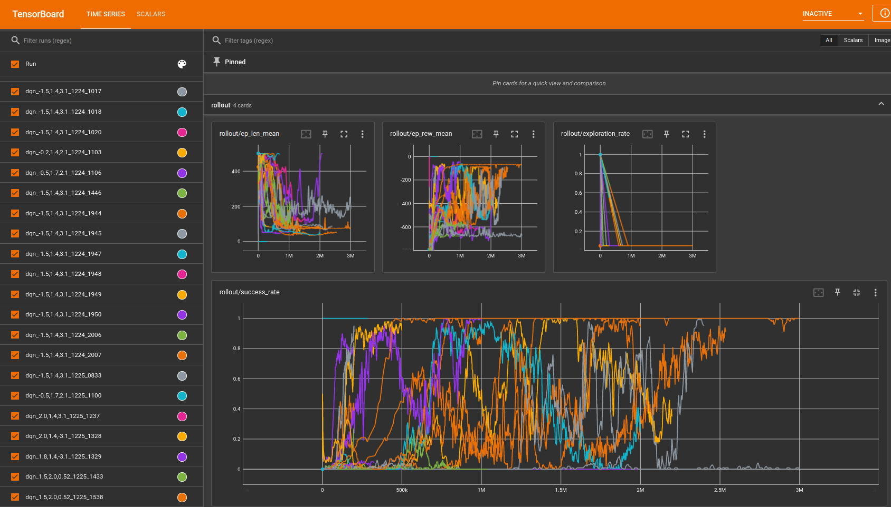

# smart-car-auto-parking

20 级数科班 2022-2023 年秋冬季大作业

综述 PDF：[语义分割和强化学习在自动驾驶中的应用](语义分割和强化学习在自动驾驶中的应用综述.pdf)

前置作业：https://github.com/lie-flat/smart-car-deep-learning

- 第一阶段成果：基于 ArUco Marker Board 的小车实时位姿测定和可视化（单目）
- 第二阶段成果：基于强化学习方法的自动泊车

B 站视频展示和讲解：

- 单目位姿测定与追踪： https://www.bilibili.com/video/BV1N24y1y7Zt/
- 强化学习自动泊车： https://www.bilibili.com/video/BV1C84y1W7zS/

开源代码：

https://github.com/lie-flat/smart-car-auto-parking

## 效果展示

您可以前往 B 站查看更清晰的版本。您也可以在 [`resources/videos` 这个目录下](resources/videos)下载原始视频文件。

| 自动泊车                                                                                                | 效果展示（GIF 压缩版）                                                                                                                  |
| ------------------------------------------------------------------------------------------------------- | --------------------------------------------------------------------------------------------------------------------------------------- |
| <br />直线倒车入库<br />完全部署模式                           | <br />直线倒车入库<br />数字孪生模式                                                            |
| <br />斜后方 120 度倒车入库<br />完全部署模式                | <br />斜后方 120 度倒车入库<br />数字孪生模式(因为忘记切换展示模式，所以显示的是完全部署模式) |
| <br />斜后方 120 度倒车入库<br />完全部署模式（另一次录制） | <br />斜后方 90 度倒车入库<br />完全部署模式                                                  |

## 环境搭建

### 软件环境搭建

我们假定您已经阅读并理解了前置作业的相关文档。

请在带有 Nvidia 独立显卡的 GNU/Linux 操作系统上运行本项目的代码，我们没有在 Windows 和 Mac 上完整得测试过代码，我们也不支持 Windows / MacOS 操作系统！！！

注意：Python 版本需要大于等于 3.10！

我们建议您使用 Mamba 来创建环境和安装 `pytorch`、`pybullet` 等依赖。注意：不要在 conda/mamba 环境里用 pip 装 pybullet, 会变的不幸。

在克隆此仓库后，请运行 `git submodule update --init` 并确保没有报错，子模块全部同步成功。

建议的配环境过程如下：

创建 Mamba 环境，安装依赖：

```bash
mamba env create --file environment.yml
mamba activate park
```

后面的操作都假设你处于此 Mamba 环境中

### 手机配置

由于新版安卓在锁屏时会禁用相机，我们需要让安卓手机保持解锁状态。
你可以使用 Wakey 这款软件来做到这一点，部分手机自带了这一功能（比如笔者正在使用的 Lineage OS 19）。

#### 第一阶段

我们需要使用如下软件将安卓手机变成 Web Cam: [DroidCam](https://www.dev47apps.com/)。

去除水印只需要一点简简单单的安卓/Java 逆向工程知识，但是出于尊重知识产权的考虑，
我们不会公开去除水印的版本，你可以购买 DroidCam 高级版来支持原作者。

我写过一篇博客, 讲解如何使用 DroidCam 作为 OpenCV 的视频源： [kxxt 的博客](https://www.kxxt.dev/blog/use-android-devices-as-cameras-in-opencv/)

Android 手机和 Linux 电脑需要在同一个局域网内，请把你的手机 IP 填入 `client/config/platform.py` 中的指定位置。
并将 `PHONE_CAM_MODE` 设置为 `droidcam`

#### 第二阶段

由于 DroidCam 延迟比较高，无法满足我们的自动泊车任务的需求。我们换用 iriun + 有线连接的方式。

在你的手机和电脑上安装 [iriun](https://iriun.com/) 这款软件。

手机上打开 iriun, 将分辨率调节为 640x480. 手机与电脑使用 USB 有线连接。
电脑端打开 iriun, 手机端允许 ADB 调试请求，即可成功连接。

然后将 `client/config/platform.py` 中的 `PHONE_CAM_MODE` 设置为 `iriun`,
`IRIUN_CAM_ID` 设置为 iriun 摄像头的编号。

#### 相机校正

你需要打印一张棋盘格纸进行相机的校正。 相机校正比较基础，不展开讲解。
你可以使用 `client.run.calibration_collector` 这个脚本来收集矫正图片， 若当前拍摄图像中能标定到棋盘格，该脚本就会保存该图像。
然后，你可以运行 `client.run.calibration` 来获得校正参数。（也可以使用 ZhangZhengyou Method, 参考网上代码）

在完成相机校正后，你需要将获得的数据填入 `client/camera/phone.py` 的 `CAMERA_MAT` 和 `DIST_COEFFS` 两个常量中去。

### 小车配置

接线细节操作请翻之前的大作业文档，此处不再赘述。

使用 Arduino IDE 打开 `firmware/camera_web_server`, 下载到 ESP32-CAM 上。

使用 VSCode + PlatformIO 打开 `firmware/main`, 构建并下载到开发板上。

开发板的热点的 SSID 是 lie-flat, 密码是 flat-lie

将以下设置写入 `device.cache.json`。

```json
{ "board": "192.168.4.1", "esp32-cam": "192.168.4.2" }
```

我们对小车进行了一定的物理改装，来让我们能在顶部平整的粘贴一张 ArUco Marker Board.

你可以运行 `python -m client.run.save_board` 这个命令来保存我们使用的 ArUco Board 的图片到 final-board.png。

然后，你可以把这张图片打印出来（推荐使用激光打印机，不反光，效果更好），贴在小车顶部，请注意让 ArUco Board 保持水平！


根据小车的实际情况，调整 `client/config/rl.py` 中小车的电机控制值 `REAL_CAR_SPEED` 和 `REAL_CAR_TURN_SPEED`。

### 场景配置

地图平铺，调整支架，保证手机摄像头水平且能拍到整张地图。


然后运行 `python -m client.run.cam`， 在显示的图片中所示的圆圈的对应实体地图位置做一个标记。

选定地图的一个角作为世界坐标系原点，计算相机坐标系到世界坐标系的旋转矩阵，
填到 `client/config/positioning.py` 的 `ROTATION` 常量里。

再根据从地图上作的标记，量出相机坐标系与世界坐标系的偏移量（Z 偏移量为摄像头高度），填入 `OFFSET_{X,Y,Z}` 常量中。

## 运行

电脑连接到开发板的热点和手机摄像头。

### 第一阶段实时位姿测定的展示(先后启动两个 Python 程序)

```bash
python -m client.run
python -m client
```

### 第二阶段强化学习自动泊车

#### 强化学习虚拟场景调试

我们提供一个交互式的环境，它可以用来进行虚拟场景的调试。

```bash
python -m client.rl.heuristic
```

脚本启动后，你将得到一个 pybullet 窗口和一个 IPython shell.


你可以在 IPython shell 中自由的执行你想要执行的代码，
进行虚拟场景的调试。要想知道这个 shell 提供了哪些全局变量和函数，请阅读它的源代码。

#### 训练强化学习模型

运行如下命令可以查看训练脚本的使用帮助。

```bash
python -m client.rl.train -h
```

示例:

训练一个 DQN 模型，总步数为 3000000，模型的种子为 114514, 初始位姿的 xy 坐标为 (1.5,2), 初始的旋转为 $\pi\over6$, 不启用墙壁，启用可视化，每 30000 步保存一个 checkpoint, 使用 racecar 汽车模型（默认是 husky），模型放大 2.2 倍：

```bash
python -m client.rl.train --model dqn --total-steps 3000000 --init-x=1.5 --init-y=2 --init-theta="np.pi/6" --no-wall --seed=114514 --render --save-freq=30000 --car=racecar --car-scale=2.2
```

你可以启动 tensorboard 来查看训练的情况：

```bash
tensorboard --logdir logs
```



#### 评估强化学习模型

运行如下命令可以查看评估脚本的使用帮助。

```bash
python -m client.rl.train -h
```

示例：

```bash
python -m client.rl.eval --model-path resources/self-parking-nn/dqn_1_1500000.zip  --eval-episodes 10 --render
```


脚本最后会输出 Mean Cummulative Reward 和标准差。

#### 部署强化学习模型

我们提供两种部署模式。

- 在数字孪生模式下，我们仍然依赖于 PyBullet 虚拟场景的数据来运行模型，
  即没有使用位姿测定得到的数据来运行模型，
  真实的小车只是简单的跟随虚拟的小车一起做出同步的运动。

- 在完全部署模式下，我们直接把位姿测定得到的数据传递给模型，
  不再依赖 pybullet 虚拟场景，完成本次大作业的最终目标。

经过多次实验，我们发现真实部署模式比数字孪生模式效果更好，这可能虚拟场景和真实场景的差异造成的。

另外，虽然真实小车的动作的定义与虚拟小车有所不同，我们发现在完全部署模式下，我们的模型仍然能够达到很好的效果。

##### 数字孪生模式

先后运行以下两个 Python 脚本

```bash
python -m client.run.parking --follow
python -m client.rl.eval --eval-episodes 1 --model-path 模型路径 \
    --init-x=起始X --init-y=起始Y --init-theta=起始theta \
    --render --real --presentation
```

##### 完全部署模式

先后运行以下两个 Python 脚本

```bash
python -m client.run.parking
python -m client.rl.real --model-path 模型路径 --eval-episodes 1
```

## Unity 3D 场景

为了更好的还原真实的场景，我们一开始使用 Unity 3D 架设了场景，组建了小车的虚拟模型，
并使用 Unity3D 提供的 ml-agents 训练了强化学习模型。

但是由于无法准确的得知小车轮胎的部分物理参数，
Unity 3D ml-agents 官方也不支持将训练得到的模型部署到 Python 脚本中去，
我们最后放弃了这个计划，转而使用 pybullet + gym + stable_baseline3。

Unity3D 工程的代码在 environment 文件夹下。


## 代码讲解

目录结构

```
smart-car-auto-parking
├── client              # Python 客户端， 位姿测定，强化学习自动泊车
├── devices.cache.json  # 设备缓存文件
├── environment         # Unity 3D 工程
├── environment.lock    # mamba 环境配置文件(版本锁定)
├── environment.yml     # mamba 环境配置文件
├── firmware            # C++ 编写的小车/ESP32CAM 固件
├── logs                # Tensorboard 日志文件夹/模型检查点保存
├── measurements        # 手动测量得到的部分参数
├── LICENSE             # 开源协议
├── README.md           # 说明文件
├── resources           # 资源文件夹
├── roadsign            # 交通标志识别模型
└── slides              # 幻灯片
```

### 第一阶段：实时位姿测定与直播推流

您也可以查看 [B 站讲解视频](https://www.bilibili.com/video/BV1N24y1y7Zt/) 或讲解幻灯片：

- [位姿测定](https://lie-flat.github.io/smart-car-auto-parking/positioning)
- [直播推流](https://lie-flat.github.io/smart-car-auto-parking/streaming)

#### 位姿测定

我们使用的 ArUco Board 定义在 `client/config/boarddef.py` 中：

```python
FINAL_BOARD_DICT = cv.aruco.getPredefinedDictionary(cv.aruco.DICT_4X4_50)
FINAL_BOARD = cv.aruco.GridBoard_create(
    markersX=5,
    markersY=4,
    markerLength=0.025,
    markerSeparation=0.01,
    dictionary=FINAL_BOARD_DICT)

FINAL_BOARD_WIDTH = 0.025 * 4 + 0.01 * 3
FINAL_BOARD_HEIGHT = 0.025 * 5 + 0.01 * 4
```

一共五行四列，每个 Marker 边长 2.5 cm, Marker 间距为 1cm。

ArUco 位姿测定的实现在 `client/cv/aruco.py` 中：

我们首先调用 aruco 模块的 `detectMarkers` 检测出图像上的所有 ArUco marker, 为了保证位姿测定的稳定性，我们只在检测出来的 Marker 数量不少于 4 个的时候才去计算 ArUco Board 的位姿。

我们通过调用 `aruco.estimatePoseBoard` 函数来计算 ArUco Board 在相机坐标系的位姿，然后，通过我们自己计算和测量得到的 `ROTATION` 矩阵和 `TRANSLATION` 向量，我们把相机坐标系的坐标转换到世界坐标系。

同时这个函数还会画出 ArUco Marker 和板子的位姿。

```python
import cv2.aruco as aruco
# 常量的引入略
def estimate_pose_and_draw(frame):
    corners, ids, _rejected_points = aruco.detectMarkers(frame, dic)
    rotation_world = None
    rotation = None
    translation = None
    translation_world = None
    if ids is not None and len(ids) >= 4:
        aruco.drawDetectedMarkers(frame, corners, ids)
        if DETECT_BOARD:
            valid_cnt, rotation, translation = aruco.estimatePoseBoard(
                corners, ids, BOARD, CAMERA_MAT, DIST_COEFFS, None, None)
            if valid_cnt > 0:
                # 画出板子的位姿（用一个坐标系来表示）
                cv.drawFrameAxes(frame, CAMERA_MAT, DIST_COEFFS, rotation, translation, 0.08, 6)
            rotation_camera, _ = cv.Rodrigues(rotation)
            rotation_world = ROTATION @ rotation_camera
            translation_world = ROTATION @ translation + TRANSLATION.reshape(3, 1)
    return frame, rotation, translation, rotation_world, translation_world
```

#### 直播推流

画面的拼接实现在 `client/cv/cat.py` 中：

首先，我们初始化各个绘图区，绘制底部固定文字。（因为 cv.putText 不支持中文字符，所以我们在这里使用 Pillow 来绘制文字）

下面的代码忽略了部分常量/变量的定义。

```python
video_buffer = np.ones((VIDEO_HEIGHT, VIDEO_WIDTH, 3),
                       dtype=np.uint8) * 255
SEPARATOR = np.ones((SEPARATOR_HEIGHT, SEPARATOR_WIDTH, 3),
                    dtype=np.uint8) * 50
info_area = np.ones(
    (INFO_AREA_HEIGHT, INFO_AREA_WIDTH, 3), dtype=np.uint8) * 255
TEXT_AREA = np.ones((TEXT_AREA_HEIGHT, TEXT_AREA_WIDTH, 3),
                    dtype=np.uint8) * 255
img_pil = Image.fromarray(TEXT_AREA)
draw = ImageDraw.Draw(img_pil)
draw.text((10, -3),  "求个 Star, 谢谢喵~: https://github.com/lie-flat/smart-car-auto-parking",
          font=CHINESE_FONT, fill=(0xFF, 0x90, 0x1E))
draw.text((1260, -3),  "非常感谢得意黑 SmileySans 这款开源字体",
          font=CHINESE_FONT, fill=(0x75, 0x7A, 0x0B))
if context['mode'] == 'run':
    draw.text((10, 45),  "*: 因为 ESP32 CAM 网络延迟问题，小车摄像头的画面有时会有不确定的延迟（一般在 1s 左右）",
              font=CHINESE_FONT, fill=(0x4B, 0x4B, 0xE5))
elif context['mode'] == 'parking-follow':
    draw.text((10, 45),  "自动泊车 -- 数字孪生模式[实体小车跟随虚拟场景小车运动，强化学习模型不使用定位数据]",
              font=CHINESE_FONT, fill=(0x4B, 0x4B, 0xE5))
elif context['mode'] == 'parking':
    draw.text((10, 45),  "自动泊车 -- 完全部署模式[强化学习模型直接根据定位数据运行，无需虚拟场景]",
              font=CHINESE_FONT, fill=(0x4B, 0x4B, 0xE5))
draw.text((1500, 45),  "山东大学（威海）,数科班",
          font=CHINESE_FONT, fill=(0xC5, 0xFF, 0x00))
TEXT_AREA = np.array(img_pil)
video_buffer[-TEXT_AREA_HEIGHT:, :] = TEXT_AREA
PLACEHOLDER = np.array([np.NaN, np.NaN, np.NaN])
traj = 255 * np.ones((MAP_LEN_X, MAP_LEN_Y, 3), dtype="uint8")
visual = 255 * np.ones((MAP_LEN_X, MAP_LEN_Y, 3), dtype="uint8")

def null_coalesce(val, fallback):
    return val if val is not None else fallback
```

然后，我们定义 `cat` 函数，它的作用是把各个画面整合到一起，和一些文字信息一同显示在 1920x1080 尺寸的全屏窗口上：

```python
def cat(phone_cam, road_mask, road_perspective, world_trans, world_rot, cam_trans, cam_rot, fps):
    """
            640           640               640
         +------------+-------------+-------------------+
      4  | marker det | road mask   | road(perspective) |
      8  | i:480x640  | i:240x320   | i:240x320x1       |
      0  | 480x640    | 480x640     | 480x640           |
         +------------+-+------------+-+----------------+
      5  | trajectory |S|rect visual |S|info display    |
      0  | i: 507x605 |1|i: 507x605  |1|xyz             |
      7  | o: 507x605 |0|o: 507x605  |0|rotation:       |
         +------------+-+------------+-+-----------------+
      93 | text                                         |
         +----------------------------------------------+
    """
    函数体参见下面讲解
```

首先，清空信息展示区和位姿可视化区，转换输入图像的色彩空间，进行缩放，处理此帧没有定到位姿的情况，显示 NaN。

```python
global p0x, p1x, p2x, p3x, p0y, p1y, p2y, p3y, traj, visual
info_area.fill(255)
visual.fill(255)
# Resize inputs

road_mask = cv.resize(road_mask, (PHONE_CAM_WIDTH, PHONE_CAM_HEIGHT))
if road_perspective.shape != (480, 640, 3):
    # Not in RL Mode.
    road_perspective = cv.cvtColor(road_perspective, cv.COLOR_GRAY2BGR)
    road_perspective = cv.resize(
        road_perspective, (PHONE_CAM_WIDTH, PHONE_CAM_HEIGHT))
    # Null coalescing
    world_trans = null_coalesce(world_trans, PLACEHOLDER)
    cam_trans = null_coalesce(cam_trans, PLACEHOLDER)
    cam_rot = null_coalesce(cam_rot, PLACEHOLDER)
```

若测定出了位姿, 计算小车的中心点的世界坐标，在可视化区画出表示位姿的矩形, 注意我们要先擦除掉上一帧中绘制的那个矩形。同时在轨迹图上画一个点。

```python
# Calc rect center
# cos t -sin t
# sin t  cos t
if world_rot is not None:
    cv.line(visual, (p0x, p0y), (p1x, p1y), WHITE, RECT_BORDER_THICKNESS)
    cv.line(visual, (p0x, p0y), (p3x, p3y), WHITE, RECT_BORDER_THICKNESS)
    cv.line(visual, (p1x, p1y), (p2x, p2y), WHITE, RECT_BORDER_THICKNESS)
    cv.line(visual, (p3x, p3y), (p2x, p2y), WHITE, RECT_BORDER_THICKNESS)
    # Then other components isn't None as well
    cost = world_rot[0, 0]
    sint = world_rot[1, 0]

    p0x = world_trans[1].item()
    p0y = world_trans[0].item()
    p1x = int((p0x + CAR_WIDTH * cost) * MAP_FACTOR)
    p1y = int((p0y - CAR_WIDTH * sint) * MAP_FACTOR)
    p3x = int((p0x + CAR_HEIGHT * sint) * MAP_FACTOR)
    p3y = int((p0y + CAR_HEIGHT * cost) * MAP_FACTOR)
    p0x = int(MAP_FACTOR*p0x)
    p0y = int(MAP_FACTOR*p0y)
    deltax = p1x - p0x
    deltay = p1y - p0y
    p2x = p3x + deltax
    p2y = p3y + deltay
    cv.line(visual, (p0x, p0y), (p1x, p1y),
            (0, 255, 0), RECT_BORDER_THICKNESS)
    cv.line(visual, (p0x, p0y), (p3x, p3y),
            (0, 0, 255), RECT_BORDER_THICKNESS)
    cv.line(visual, (p1x, p1y), (p2x, p2y),
            (255, 0, 0), RECT_BORDER_THICKNESS)
    cv.line(visual, (p3x, p3y), (p2x, p2y),
            (0, 0, 0), RECT_BORDER_THICKNESS)
    pos = (int((p0x + p2x)/2), int((p0y+p2y)/2))

    visual = cv.circle(visual, pos, 4, (0x6E, 0x00, 0xFF), 4)
    # Convert mats to vecs
    world_rot, _ = cv.Rodrigues(world_rot)
    traj = cv.circle(traj, pos, 4, (0x6E, 0x00, 0xFF), 6)
else:
    world_rot = PLACEHOLDER
```

然后绘制数据显示区的文字，包括摄像机坐标系的位置，旋转以及世界坐标系的位置和旋转，还有实时帧率：

```python
# get numbers from vecs
world_x = world_trans[0].item()
world_y = world_trans[1].item()
world_z = world_trans[2].item()
cam_x = cam_trans[0].item()
cam_y = cam_trans[1].item()
cam_z = cam_trans[2].item()
cam_rx = cam_rot[0].item()
cam_ry = cam_rot[1].item()
cam_rz = cam_rot[2].item()
world_rx = world_rot[0].item()
world_ry = world_rot[1].item()
world_rz = world_rot[2].item()
cv.putText(info_area,  f"World X : {world_x:.8}", (10, 40),
           CV_FONT, FONT_SCALE, CV_COLOR, FONT_LINE_WIDTH, cv.LINE_AA)
cv.putText(info_area,  f"World Y : {world_y:.8}", (10, 80),
           CV_FONT, FONT_SCALE, CV_COLOR, FONT_LINE_WIDTH, cv.LINE_AA)
cv.putText(info_area,  f"World Z : {world_z:.8}", (10, 120),
           CV_FONT, FONT_SCALE, CV_COLOR, FONT_LINE_WIDTH, cv.LINE_AA)
cv.putText(info_area,  f"World RX: {world_rx:.8}", (10, 160),
           CV_FONT, FONT_SCALE, CV_COLOR, FONT_LINE_WIDTH, cv.LINE_AA)
cv.putText(info_area,  f"World RY: {world_ry:.8}", (10, 200),
           CV_FONT, FONT_SCALE, CV_COLOR, FONT_LINE_WIDTH, cv.LINE_AA)
cv.putText(info_area,  f"World RZ: {world_rz:.8}", (10, 240),
           CV_FONT, FONT_SCALE, CV_COLOR, FONT_LINE_WIDTH, cv.LINE_AA)
cv.putText(info_area,  f"Cam  X : {cam_x:.8}", (10, 280),
           CV_FONT, FONT_SCALE, CV_COLOR, FONT_LINE_WIDTH, cv.LINE_AA)
cv.putText(info_area,  f"Cam  Y : {cam_y:.8}", (10, 320),
           CV_FONT, FONT_SCALE, CV_COLOR, FONT_LINE_WIDTH, cv.LINE_AA)
cv.putText(info_area,  f"Cam  Z : {cam_z:.8}", (10, 360),
           CV_FONT, FONT_SCALE, CV_COLOR, FONT_LINE_WIDTH, cv.LINE_AA)
cv.putText(info_area,  f"Cam  RX: {cam_rx:.8}", (10, 400),
           CV_FONT, FONT_SCALE, CV_COLOR, FONT_LINE_WIDTH, cv.LINE_AA)
cv.putText(info_area,  f"Cam  RY: {cam_ry:.8}", (10, 440),
           CV_FONT, FONT_SCALE, CV_COLOR, FONT_LINE_WIDTH, cv.LINE_AA)
cv.putText(info_area,  f"Cam  RZ: {cam_rz:.8}", (10, 480),
           CV_FONT, FONT_SCALE, CV_COLOR, FONT_LINE_WIDTH, cv.LINE_AA)
cv.putText(info_area,  "FPS", (550, 40),
           CV_FONT, FONT_SCALE, (0, 255, 0), FONT_LINE_WIDTH, cv.LINE_AA)
cv.putText(info_area,  f"{fps:.2f}", (550, 80),
           CV_FONT, FONT_SCALE, (0, 255, 0), FONT_LINE_WIDTH, cv.LINE_AA)
```

然后拼接视频画面并返回结果：

```python
video_buffer[:PHONE_CAM_HEIGHT, :PHONE_CAM_WIDTH] = cv.flip(phone_cam, 1)
video_buffer[:PHONE_CAM_HEIGHT,
             PHONE_CAM_WIDTH:2 * PHONE_CAM_WIDTH] = road_mask
video_buffer[:PHONE_CAM_HEIGHT, 2*PHONE_CAM_WIDTH:] = road_perspective
video_buffer[PHONE_CAM_HEIGHT:PHONE_CAM_HEIGHT +
             MAP_LEN_X, :MAP_LEN_Y] = traj
video_buffer[PHONE_CAM_HEIGHT:PHONE_CAM_HEIGHT +
             MAP_LEN_X, MAP_LEN_Y:MAP_LEN_Y + SEPARATOR_WIDTH] = SEPARATOR
video_buffer[PHONE_CAM_HEIGHT:PHONE_CAM_HEIGHT +
             MAP_LEN_X, MAP_LEN_Y + SEPARATOR_WIDTH: MAP_LEN_Y + SEPARATOR_WIDTH + MAP_LEN_Y] = visual
video_buffer[PHONE_CAM_HEIGHT:PHONE_CAM_HEIGHT +
             MAP_LEN_X, MAP_LEN_Y + SEPARATOR_WIDTH + MAP_LEN_Y: MAP_LEN_Y + SEPARATOR_WIDTH + MAP_LEN_Y + SEPARATOR_WIDTH] = SEPARATOR
video_buffer[PHONE_CAM_HEIGHT:PHONE_CAM_HEIGHT + MAP_LEN_X,
             MAP_LEN_Y + SEPARATOR_WIDTH + MAP_LEN_Y + SEPARATOR_WIDTH:] = info_area
return video_buffer
```

### 第二阶段：强化学习自动泊车

#### 小车同步运动 API

之前我们编写的小车的运动 API 是异步的，有状态的，对小车的控制受网络延迟影响大。

这一次我们编写了小车的同步运动 API， 来实现对小车运动的精确控制：

客户端向小车发送请求，让电机和舵机处于指定状态指定长度时间，然后小车停止电机并给客户端返回 `200 OK`

下面是 `firmware/main/src/main.cpp` 的节选:

因为 request handler 在中断里，我们不能阻塞太长时间，否则会触发 watchdog 错误导致重启，所以我们把请求指针塞到一个 FreeRTOS 的队列里去（大小为一即可，我们不支持在上一条同步运动请求完成前执行下一条同步运动请求）。

```c++
QueueHandle_t cmdQueue;

void setup() {
    ...
    cmdQueue = xQueueCreate(1, sizeof(AsyncWebServerRequest*));
    server.on("/act", HTTP_POST, [](AsyncWebServerRequest* request) {
    	// Put the request in the queue
    	if (xQueueSend(cmdQueue, (void*)&request, (TickType_t)10) != pdPASS) {
      		request->send(500);
    	}
  	});
    ...
}
```

然后，我们在 `loop` 里处理请求, 解析出请求参数，调用 `act` 函数，待运动完成后，再给客户端返回 200。

```c++
void loop() {
  if (uxQueueMessagesWaiting(cmdQueue)) {
    AsyncWebServerRequest* request;
    if (xQueueReceive(cmdQueue, &request, (TickType_t)10)) {
      auto duration = parse_int_param(request, "duration");
      auto servo = parse_float_param(request, SERVO_PARAM);
      auto motor_a = parse_float_param(request, MOTOR_A_PARAM);
      auto motor_b = parse_float_param(request, MOTOR_B_PARAM);
      act(servo, motor_a, motor_b, duration);
      request->send(200, "text/plain", "OK");
    }
  }
}
```

`act` 函数调用我们之前写好的 `set_a`,`set_b`,`set_servo` 来控制小车运动, 我们使用 FreeRTOS 的 `vTaskDelay` 来等待 `duration` 毫秒，最后让电机停止运动。

```c++
void act(float servo, float motor_a, float motor_b, int duration) {
  set_servo(servo);
  set_a(motor_a);
  set_b(motor_b);
  vTaskDelay(duration);
  set_a(0);
  set_b(0);
}
```

然后，配套地，我们有如下的 python 库代码(`client/controller/control.py`):

```python
def act(ip, servo=7.5, a=0, b=0, duration=0):
    body = {
        "servo": servo,
        "motorA": a,
        "motorB": b,
        "duration": duration
    }
    requests.post(f"http://{ip}/act", body)
```

#### 配置项

为了方便更改，我们把配置抽出来作为一个 python 模块：`client.config`.

该子模块下有以下配置文件：

- aruco.py: ArUco 检测配置
- boarddef.py： ArUco 板子定义
- common.py：公共设置
- control.py：关键运行模式控制和上下文定义
- misc.py： 杂项
- platform.py：平台相关配置，摄像头运行模式配置
- positioning.py：位姿测定配置
- resources.py：资源配置
- rl.py：强化学习配置

#### 强化学习环境

为了方便，我们把地图等比例放大五倍（以米为单位），地图的 URDF 位于 `resources/ground.urdf`。

我们在 `client/rl/base.py` 中定义了虚拟场景和真实场景的公共基类 `ParkingLotEnvBase`.

这个基类定义了小车的始末位姿、状态空间、误差范围、动作空间、奖励权重、基于共享内存的跨进程数据收集器、距离和奖励的计算函数等。

我们给小车定义了 前进、后退、左转、右转 这四种离散动作（我们在 Unity 3D 环境中采用了连续动作空间）。

然后，我们在 `client/rl/env.py` 中定义了虚拟场景 `ParkingLotEnv`, 该虚拟场景在其基类的基础上增加了 pybullet 仿真的相关功能，实现了一个用来训练和评估强化学习模型的虚拟场景。（代码太长，我不贴了）

为了方便调试虚拟场景，我们还编写了一个脚本： `client/rl/heuristic.py`, 这个脚本会启动 pybullet 场景，同时给你一个 IPython shell 来自由探索，你可以使用 `w`, `a`, `s`, `d` 这四个函数来移动小车，它们接受的参数是运动步数，它们返回结束时的小车的观测值。运行 `reset()` 来重置环境。你也可以调用 pybullet 来随意的修改虚拟场景。

```python
import gym
import pybullet as p
from IPython import embed
from .cmd_parser import build_parser, grab_args
from .impl import make_env
from time import sleep
from math import *
from ..config.rl import *
if __name__ == '__main__':
    parser = build_parser()
    args = grab_args(parser)
    args.render = True
    env = make_env(args)
    env.reset()
    unwrapped = env.unwrapped
    car = unwrapped.car
    reset = env.reset
    def movement_generator(action):
        def f(t=2):
            for _ in range(t):
                obs = env.step(action)
            else:
                return obs
        return f
    w = movement_generator(0)
    s = movement_generator(1)
    a = movement_generator(2)
    d = movement_generator(3)
    embed(header="You are on your own now. Feel free to explore!")
```

另外，我们在 `client/rl/real.py` 中定义了真实场景 `RealParkingLotEnv`, 该虚拟场景在其基类的基础上增加了控制物理小车运动，基于共享内存的环境观测信息收集等功能，实现了用于完全部署模式的真实场景。（代码太长，我不贴了）

我们在 `client/rl/__init__.py` 中注册了上述两个环境，然后我们就可以使用字符串 ID 调用这两个环境了：

```python
from gym.envs.registration import register

register(id='ParkingLot-v0', entry_point='client.rl.env:ParkingLotEnv')
register(id='RealParkingLot-v0', entry_point='client.rl.real:RealParkingLotEnv')
```

小车相关的代码在 `client/rl/car.py` 中，`Car` 类负责了虚拟/真实小车的控制，pybullet 环境小车加载和观测数据收集等功能。

为了方便从命令行参数创建环境，我们编写了以下函数(在 `client/rl/impl.py` 中)：

```python
def make_env(args):
    return gym.make(args.env, render=args.render, car_type=args.car,
                    init_x=args.init_x, init_y=args.init_y, init_theta=args.init_theta,
                    car_scaling=args.car_scale, real=args.real, presentation_mode=args.presentation,
                    wall=args.wall)
```

#### 模型训练/评估

`client/rl/cmd_parser.py` 定义了公共的命令行参数解析器。

我们在 `client/rl/models.py` 中对各种模型做了一个抽象，使得我们能够方便的通过命令行参数来切换模型:

获得模型类：

```python
def get_model_class_by_name(name):
    match name:
        case 'dqn':
            return DQN
        case 'ppo':
            return PPO
        case _:
            raise ValueError(f"Invalid model {name}!")
```

获得自定义模型构造器:

```python
def get_model_ctor_by_name(name):
    match name:
        case 'dqn':
            return partial(DQN,  exploration_fraction=0.3,
                           exploration_initial_eps=1.0,
                           exploration_final_eps=0.05,)
        case 'ppo':
            return PPO
        case _:
            raise ValueError(f"Invalid model {name}!")
```

初始化模型:

```python
def init_model_by_name(name, **kwargs):
    model_class = get_model_ctor_by_name(name)
    return model_class('MlpPolicy', **kwargs)
```

模型训练和评估的主要代码在 `client/rl/impl.py` 中。

模型训练：

创建环境，如果命令行参数指定了恢复模型的路径，那么加载要恢复训练的模型，否则就初始化一个新模型。最后，重置环境，开始训练。训练结束后保存模型。

```python
def train(args):
    env = make_env(args)
    checkpoint_callback = CheckpointCallback(
        save_freq=args.save_freq, save_path=args.ckpt_path, name_prefix=args.model)
    if args.resume_from:
        model_class = get_model_class_by_name(args.model)
        path = Path(args.resume_from)
        if path.is_file():
            model_path = args.resume_from
        else:
            model = str(path/'final.zip')
        model = model_class.load(model_path, env=env)
    else:
        model = init_model_by_name(
            args.model, env=env, verbose=1, seed=args.seed)
    logger = configure(args.log_dir, ["tensorboard"])
    model.set_logger(logger)
    env.reset()
    model.learn(total_timesteps=args.total_steps,
                callback=checkpoint_callback)
    model.save(args.model_path)
    env.close()
```

模型评估：

```python
def evaluate(args, env_maker=make_env):
    env = Monitor(env_maker(args))
    model_class = get_model_class_by_name(args.model)

    path = Path(args.model_path)
    model_path = str(path).removesuffix(
        ".zip") if path.is_file() else str(path/'final')
    model = model_class.load(model_path, env)
    env.reset()
    mean, std = evaluate_policy(
        model, env, n_eval_episodes=args.eval_episodes, render=args.render)
    print(f"{Fore.YELLOW}Mean reward: {mean}, Std: {std}{Style.RESET_ALL}", file=stderr)
```

#### 模型部署

效果展示的脚本位于 `client/run/parking.py`. 出于性能因素考虑，我们没有将效果展示和自动泊车写到一个程序里，我们把它们分到了两个程序中并行运行。

`client/run/parking.py` 实时地测定小车的位置和姿态，并且通过位姿变换把数据变换成观测数据，同时可视化到屏幕上。同时，它通过共享内存的方式读取自动泊车的相关信息，一并显示在屏幕上。在完全部署模式下，该脚本还会把观测数据通过共享内存的方式传递回自动泊车脚本。

首先，我们定义一些数组形式的绘图区域，初始化数据收集器，初始化反馈信息所需要的共享内存及文件锁。

```python
img_result = np.zeros(IMG_RESULT_SHAPE, dtype=np.uint8)
rl_info_area = np.zeros((480, 640, 3), dtype=np.uint8)

analytics_reader = AnalyticsReader()
analytics = {}

draw_rl_info_with_color = partial(cv.putText, rl_info_area, fontFace=CV_FONT, fontScale=FONT_SCALE,
                                  thickness=FONT_LINE_WIDTH, lineType=cv.LINE_AA)
draw_rl_info = partial(draw_rl_info_with_color, color=CV_COLOR)

feedback_shm = create_shared_memory_nparray(np.zeros(
    FEEDBACK_SIZE, dtype=FEEDBACK_DTYPE), FEEDBACK_SHM_NAME, FEEDBACK_DTYPE)
feedback_arr = np.ndarray(
    FEEDBACK_SIZE, dtype=FEEDBACK_DTYPE, buffer=feedback_shm.buf)
feedback_lock = FileLock(FEEDBACK_FILELOCK_PATH)
```

然后我们定义更新强化学习数据显示的函数：

```python
def update_rl_info(pos, velocity, z_rotation, z_cos_t, z_sin_t):
    analytics_reader.read_to_dict(analytics)
    rl_info_area.fill(255)
    draw_rl_info(text=f"  Last Action  : {analytics['last_action']}", org=(10, 35))
    draw_rl_info(text=f"  Last Reward : {analytics['last_reward']}", org=(10, 70))
    draw_rl_info(text=f" Cum Reward  : {analytics['cummulative_reward']}", org=(10, 105))
    draw_rl_info(text=f" Step  Counter : {analytics['step_counter']}", org=(10, 140))
    draw_rl_info(text=f" Distance  : {analytics['distance']}", org=(10, 175))
    draw_rl_info_with_color(text=f"    > Observation Data <", org=(10, 210), color=(255,255,0))
    draw_rl_info(text=f"  X Pos   : {pos[0]:.8f}", org=(10, 245))
    draw_rl_info(text=f"  Y Pos   : {pos[1]:.8f}", org=(10, 280))
    draw_rl_info(text=f"X Velocity : {velocity[0]:.8f}", org=(10, 315))
    draw_rl_info(text=f"Y Velocity : {velocity[1]:.8f}", org=(10, 350))
    draw_rl_info(text=f"Z Rotation: {z_rotation:.8f}", org=(10, 385))
    draw_rl_info(text=f"Cos(Rz)={z_cos_t:.8f}", org=(10, 430))
    draw_rl_info(text=f"Sin(Rz)={z_sin_t:.8f}", org=(10, 470))
```

在 `main` 函数中，我们先初始化各种数据（比如上一次位姿测定时间，存储从世界坐标变换后的仿真中的位姿矩阵的变量，z 方向的旋转，世界坐标系位姿，速度等等），拉起全屏窗口。

```python
global img_result, rl_info_area, last_pos, feedback_lock, feedback_arr
last_pos_measure_time = None
sim_tr = np.eye(4, dtype=np.float32)
pos = np.array([np.nan, np.nan])
z_rotation = np.nan
z_sin_t = np.nan
z_cos_t = np.nan
velocity = np.array([np.nan, np.nan])
world_tr = np.ndarray((4, 4), dtype=np.float32)
world_tr[3, :] = [0, 0, 0, 1]
cv.namedWindow("frame", cv.WINDOW_NORMAL)
cv.setWindowProperty("frame", cv.WND_PROP_FULLSCREEN, cv.WINDOW_FULLSCREEN)
```

然后连接到手机摄像头获取图像, 定义几个用来计算 FPS 的变量:

```python
vid = get_phone_video()
# used to record the time when we processed last frame
prev_frame_time = 0
# used to record the time at which we processed current frame
new_frame_time = 0
```

接下来是主循环：

在主循环中，我们先计算小车的位置和姿态，如果该帧中可以计算得出小车的位姿，我们就再将世界坐标系的位姿变换到强化学习环境坐标系（平移+旋转+拉伸 共三个变换），然后计算小车的速度(在强化学习的环境坐标系中)， z 方向旋转的正弦和余弦等强化学习模型需要的数据。如果在完全部署模式下，我们给反馈信息共享内存加锁并将计算得到的数据写入反馈信息数组中，这样就把数据反馈给了强化学习模型所在的进程。然后，更新显示的数据和画面。

```python
while True:
    ret, frame = vid.read()
    if not ret:
        raise Exception("Failed to read from phone.")
        frame, rotation, translation, rotation_world, translation_world \
        = estimate_pose_and_draw(frame)
        if translation_world is not None:
            world_tr[:3, :3] = rotation_world
            world_tr[3, 3] = 1
            # Calculate the center of aruco board
            cost = rotation_world[0, 0]
            sint = rotation_world[1, 0]
            p0x = translation_world[1].item()
            p0y = translation_world[0].item()
            p1x = p0x + FINAL_BOARD_WIDTH * cost
            p1y = p0y - FINAL_BOARD_WIDTH * sint
            p3x = p0x + FINAL_BOARD_HEIGHT * sint
            p3y = p0y + FINAL_BOARD_HEIGHT * cost
            center_x = (p1x + p3x)/2
            center_y = (p1y + p3y)/2
            world_tr[:2, 3] = [center_y, center_x]  # This is not a mistake
            last_pos = pos
            sim_tr = REAL2SIM @ world_tr
            time_now = time()
            if last_pos_measure_time is None:
                last_pos_measure_time = time()
                delta_t = time_now - last_pos_measure_time
                pos = SIM_SCALE * sim_tr[:2, 3]
                velocity = (pos - last_pos) / delta_t
                last_pos_measure_time = time_now
                z_rotation = np.pi - abs(np.arctan2(sim_tr[1, 0], sim_tr[0, 0]))
                z_cos_t = np.cos(z_rotation)
                z_sin_t = np.sin(z_rotation)
                if context['mode'] == 'parking':
                    with feedback_lock:
                        # share observation via shared memory
                        feedback_arr[:2] = pos
                        feedback_arr[2:4] = velocity
                        feedback_arr[4:] = [z_cos_t, z_sin_t]

            update_rl_info(pos, velocity, z_rotation, z_cos_t, z_sin_t)
            new_frame_time = time()
            fps = 1/(new_frame_time-prev_frame_time)
            prev_frame_time = new_frame_time
            all_concat = cat(frame, img_result, rl_info_area, translation_world,
                             rotation_world, translation, rotation, fps)
            cv.imshow("frame", all_concat)
            if cv.waitKey(1) & 0xFF == ord('q'):
                break
```

`client/rl/analytics.py` 封装了收集自动泊车信息的类 `AnalyticsCollector/AnalyticsReader`:

我们使用文件锁作为两个进程读写共享内存的互斥量来防止脏读（Dirty Read）问题的出现。在大作业的第一阶段我们并没有类似的机制来防止脏读，这是因为第一阶段共享内存的数据为图像数据，脏读图像并无不良影响，几乎不影响图像的呈现。

```python
class AnalyticsCollector:
    """
    Collect analytic info into shared memory
    """
    def __init__(self):
        self.shm = SharedMemory(name=ENVINFO_SHM_NAME)
        self.array = np.ndarray(ENVINFO_SIZE, dtype=ENVINFO_DTYPE,
                                buffer=self.shm.buf)
        self.lock = FileLock(ENVINFO_FILELOCK_PATH)
    def lock_and_modify(self, f):
        with self.lock:
            f(self.array)
class AnalyticsReader:
    def __init__(self) -> None:
        self.shm = create_shared_memory_nparray(
            np.zeros(ENVINFO_SIZE, dtype=ENVINFO_DTYPE), ENVINFO_SHM_NAME, ENVINFO_DTYPE)
        self.array = np.ndarray(ENVINFO_SIZE, dtype=ENVINFO_DTYPE,
                                buffer=self.shm.buf)
        self.lock = FileLock(ENVINFO_FILELOCK_PATH)
    def read_to_dict(self, out_dict):
        with self.lock:
            out_dict["last_action"] = int(self.array[0])
            out_dict["last_reward"] = self.array[1]
            out_dict["cummulative_reward"] = self.array[2]
            out_dict["step_counter"] = int(self.array[3])
            out_dict["success"] = int(self.array[4]) == 1
            out_dict["distance"] = self.array[5]
```

## Reference

- https://markhedleyjones.com/projects/calibration-checkerboard-collection
- https://calib.io/pages/camera-calibration-pattern-generator
- https://docs.opencv.org/4.6.0/d5/dae/tutorial_aruco_detection.html
- https://docs.opencv.org/4.6.0/db/da9/tutorial_aruco_board_detection.html
- https://docs.opencv.org/4.6.0/df/d4a/tutorial_charuco_detection.html
- https://docs.opencv.org/4.6.0/d1/dcb/tutorial_aruco_faq.html
- https://github.com/RyanLiu112/RL_parking
- https://github.com/Robotics-Club-IIT-BHU/gym-carpark
- https://github.com/VanIseghemThomas/AI-Parking-Unity
- https://docs.google.com/document/d/10sXEhzFRSnvFcl3XxNGhnD4N2SedqwdAvK3dsihxVUA/edit#heading=h.gpdptdmpokh
- https://petercorke.github.io/spatialmath-python/
- https://docs.python.org/3/library/multiprocessing.shared_memory.html
- https://stable-baselines3.readthedocs.io/en/master/
- https://www.gymlibrary.dev/content/environment_creation/
- https://unity-technologies.github.io/ml-agents/ML-Agents-Toolkit-Documentation/
- https://docs.python.org/3/library/argparse.html
- https://github.com/me-no-dev/ESPAsyncWebServer
